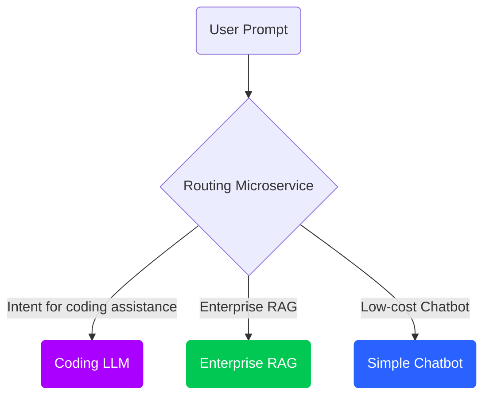

# 24-11-18-OPEA-Router-Microservice

A Router Microservice to route requests to the appropriate LLM microservices in OPEA

## Description
Given the increasing number of LLM microservices in OPEA, we propose a new Router microservice that can route user requests to the appropriate LLM microservices based on the user's intent and complexity of the prompt. The Router microservice will use a light weight machine learning model to classify user requests and route them to the correct LLM microservice. The Router microservice will also be able to handle multiple intents and route requests to the appropriate LLM microservices based on the user's intent. This will increase the total capacity of the data center by reducing the load on individual LLM microservices and improve the overall performance.

Code contributions:
"router" component: 
"animation" component: https://github.com/opea-project/GenAIComps/tree/main/comps/animation/wav2lip  
"AvatarChatbot" examples: https://github.com/opea-project/GenAIExamples/tree/main/AvatarChatbot

## Reference:
RouteLLM GitHub repo - https://github.com/lm-sys/RouteLLM

## Author
<!-- List all contributors to this RFC. -->
[haim-barad](https://github.com/haim-barad), [MadisonEvans94](https://github.com/MadisonEvans94)

Routing examples and reference blog posts, youtube videos, etc.:

Intel Developer Zone Article "Create an AI Avatar Talking Bot with PyTorch* and Open Platform for Enterprise AI (OPEA)": https://www.intel.com/content/www/us/en/developer/articles/technical/ai-avatar-talking-bot-with-pytorch-and-opea.html 
 
YouTube tech-talk video: https://youtu.be/OjaElyUB8Z0?si=6-IdxwTg0YFMraFl

## Status
<!-- Change the PR status to Under Review | Rejected | Accepted. -->
v0.1 - ASMO Team sharing on Thursday 10/24/2024  
* [GenAIComps pr #775](https://github.com/opea-project/GenAIComps/pull/775) | Merged  
* [GenAIExamples pr #923](https://github.com/opea-project/GenAIExamples/pull/923) | Merged

## Objective
<!-- List what problem will this solve? What are the goals and non-goals of this RFC? -->
* The objective of this RFC is to introduce a new microservice, routing, that can route user requests to the appropriate LLM microservices in OPEA based on the user's intent and complexity of the query. The routing microservice will use a machine learning model to classify user requests and route them to the correct LLM microservice. The routing microservice will also be able to handle multiple intents and route requests to the appropriate LLM microservices.
* Dynamic Execution isn’t limited to just optimizing a specific task (e.g. generating a sequence of text). We can take a step above the LLM and look at the entire pipeline. Suppose we are running a huge LLM in our data center (or we’re being billed by OpenAI for token generation via their API), can we optimize the calls to LLM so that we select the best LLM for the job (and “best” could be a function of token generation cost). Complicated prompts might require a more expensive LLM, but many prompts can be handled with much lower cost on a simpler LLM (or even locally on your notebook). So if we can route our prompt to the appropriate destination, then we can optimize our tasks based on several criteria.
* Routing is a form of classification in which the prompt is used to determine the best model. The prompt is then routed to this model. By best, we can use different criteria to determine the most effective model in terms of cost and accuracy. In many ways, routing is a form of dynamic execution done at the pipeline level where many of the other optimizations we are focusing on in this paper is done to make each LLM more efficient. For example, RouteLLM is an open-source framework for serving LLM routers and provides several mechanisms for reference, such as matrix factorization. [17][1] In this study, the researchers at LMSys were able to save 85% of costs while still keeping 95% accuracy.

[1] I. Ong, A. Almahairi, V. Wu, W.-L. Chiang, T. Wu, J. E.
Gonzalez, M. W. Kadous, and I. Stoica, “RouteLLM: Learn-
ing to Route LLMs with Preference Data,” July 2024.
arXiv:2406.18665 [cs].

New microservices include:    # TODO: Add the new microservices
* [animation](https://github.com/opea-project/GenAIComps/tree/main/comps/animation/wav2lip) 

## Motivation
<!-- List why this problem is valuable to solve? Whether some related work exists? -->
* Various LLM models have different compute requirements and accuracy. Many user prompts don't require the largest models and can be sent to smaller and more efficient models. The routing microservice will be able to classify user requests and route them to the appropriate LLM microservices based on the user's intent and complexity of the query. This will increase the total capacity of the data center by reducing the load on individual LLM microservices and improve the overall performance.
* A good example of a commercial routing service is withmartian.com. WithMartian is a service that routes your prompt to the best model based on the prompt. It is a commercial service that is used by many companies to optimize their LLM usage. The service is able to route the prompt to the best model based on the prompt and the cost of the model. This is a good example of how routing can be used to optimize LLM usage.
* Routing can also include other factors, such as uptime, topical relevance, advanced features such as RAG, and more. The routing service can be used to route the prompt to the best model based on these factors. This is a good example of how routing can be used to optimize LLM usage.

Related works include [RouteLLM blog article](https://lmsys.org/blog/2024-07-01-routellm/), [RouteLLM paper](https://arxiv.org/abs/2406.18665)

## Design Proposal
<!-- This is the heart of the document, used to elaborate the design philosophy and detail proposal. -->

### Routing Microservice Design
<!-- Removed PPT slides -->

Flowchart: Routing Microservice  
<!-- Insert Mermaid flowchart here -->

### Real-time demo

## Compatibility
<!-- List possible incompatible interface or workflow changes if exists. -->
The new Routing microservice is compatible with the existing OPEA GenAIExamples and GenAIComps repos. It is deployable on Intel® Xeon®.

## Miscs
<!-- List other information user and developer may care about, such as:
- Performance Impact, such as speed, memory, accuracy.
- Engineering Impact, such as binary size, startup time, build time, test times.
- Security Impact, such as code vulnerability.
- TODO List or staging plan.  -->
